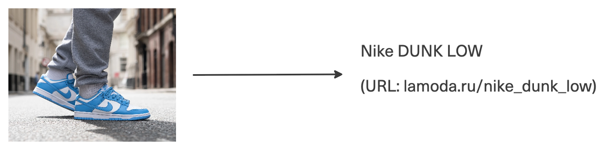
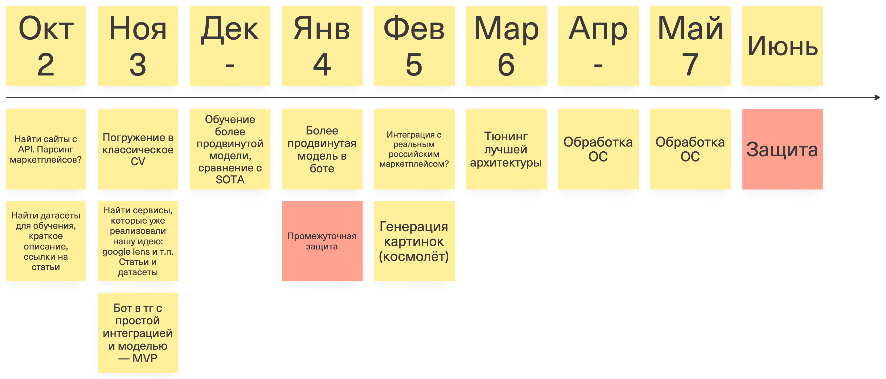

# Проект №25 «Платформа для поиска похожих кроссовок»

*MVP вариант:* реализуем пополняемую БД, где изображению сопоставлена модель кроссовок, и через бота в тг можно осуществлять поиск по ней. 

*Целевой вариант:* интеграция с реальным маркетплейсом (поиск наиболее похожих кроссовок среди тех, которые реально продаются). 

*Стретч:* генерируем изображение рандомных кроссовок и спрашиваем у пользователя «что нужно поменять в них, чтобы они стали кроссовками мечты». На основе ответа генерируем изображение (через существующую генеративную модель) и, если оно удовлетворяет пользователю, ищем наиболее похожие кроссовки среди существующих.

**Состав команды:**

* Ахмадуллин Азат (*tg: @donotdividebyzero*)
* Макаренко Александр (*tg: @xan_d_or*)
* Семячкин Александр (*tg: @alexansemyachkin*)

**Куратор:** Булыгин Глеб (*tg: @jdbelg*)

<b>План работы</b></h2>

* Найти датасет, достаточно полный, большой, чтобы его хватило для обучения хорошей модели. Провести EDA. Найти сайты с открытыми API
* **[К НГ]** Построить бейзлайн из классического подхода CV (гистограммные методы, выделить табличные фичи, и т.п.) + создать простой сервис. Проработать интеграцию с сайтами
    * Обучить классификатор по моделям с помощью классического CV
* Реализовать более сложную модель — дообученную большую модель. Обучить с нуля продвинутый метод для CV и поиска похожих элементов. Поэкспериментируем с архитектурой:
    - Обучить классификатор по брендам / моделям с помощью DL моделей
    - Обучить бинарный классификатор, по двум картинкам определяющий, одна и та же ли это пара
    - Построить image2image поиск (с использованием faiss или векторных баз данных)
    - Обучение моделей с similarity learning
    - Добавить text2image и image2text поиск
    - Если модели работали на "чистых" изображениях (без фона), попробовать использовать данные из реального мира
* Реализовать усложненный сервис, в идеале с интеграцией с сайтами магазинов/маркетплейсами, чтобы находить реальные товары

[Датасеты и статьи по теме](https://docs.google.com/spreadsheets/d/1q_4VS8RM5yxqu5o1Ya2YIPT9pRd370lXfvbp9relDS4/edit?gid=0#gid=0) (таблица будет пополняться)

