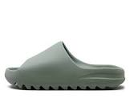

## Выводы на основе разведочного анализа датасета.

### Какие данные нам нужны?

В рамках проекта мы решаем задачу поиска похожих кроссовок по их изображению. Возможным решением этой задачи является следующий пайплайн: извлекаем из изображения важные для пользователя характеристики (цвет, материал изготовления, форма) и применяем их в фильтрах для поиска в онлайн-магазине.

Проблемой предложенного пайплайна является то, что не все важные характеристики доступны для фильтрации: например, форму кроссовок сложно ёмко описать словами, поэтому такой фильтр обычно отсутствует в поиске онлайн-магазина (например, на Lamoda можно выбрать только между вариантами «Высокие кроссовки» и «Низкие кроссовки»).

Для решения этой проблемы мы хотим воспользоваться тем, что форма кроссовки обычно определяется её моделью. Значит, чтобы найти наиболее похожие кроссовки с точки зрения формы, нам достаточно классифицировать изображение по модели — решить задачу многоклассовой классификации.

В дальнейшем мы сможем совместить поиск по форме с экстракцией других характеристик (цвета, материала) и предлагать пользователю сортировать выдачу в зависимости от того, какая из характеристик представляется ему самой важной.

Сейчас предлагаем сконцентрироваться на определении модели кроссовки по её изображению.

### Описание данных

Задачу определения модели кроссовок по их изображению уже решали, поэтому анализируем существуюший датасет, и по итогам его анализа поймём, нужно ли нам собирать дополнительные данные самостоятельно, или же этих данных достаточно.

Мы провели EDA датасета [Popular Sneakers Classification](https://www.kaggle.com/datasets/nikolasgegenava/sneakers-classification?resource=download) с Kaggle.

Датасет содержит 5953 изображений кроссовок, сгруппированных по модели. 145 изображений, которые относятся к модели ‘Yeezy Slide’ мы исключаем из рассмотрения, поскольку они не укладываются в наши представления о кроссовках:

